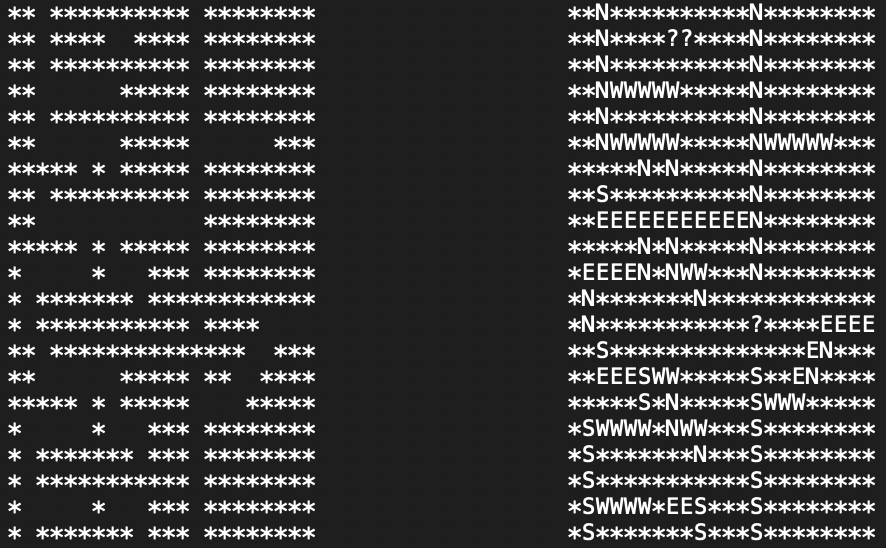

<a name="readme-top"></a>

<!-- PROJECT LOGO -->
<br />
<div align="center">
  <a href="https://github.com/cgarcia156/MazeEscape">
    <!---->
  </a>
  
  <h3 align="center">Maze Escape</h3>

  <p align="center">
    <br />
    <a href="https://github.com/cgarcia156/MazeEscape/issues">Report Bug</a>
    ·
    <a href="https://github.com/cgarcia156/MazeEscape/issues">Request Feature</a>
  </p>
</div>


<!-- TABLE OF CONTENTS -->
<details>
  <summary>Table of Contents</summary>
  <ol>
    <li>
      <a href="#about-the-project">About The Project</a>
    </li>
    <li>
      <a href="#getting-started">Getting Started</a>
    </li>
    <li><a href="#input-file-format">Input File Format</a></li>
    <li><a href="#contact">Contact</a></li>
  </ol>
</details>


<!-- ABOUT THE PROJECT -->
## About The Project

<div align="center">

</div>

This maze escape program finds the direction to escape from any point in a given maze. When the program is run, it will prompt for a text file containing the maze. [See the proper file format here](#input-file-format)


<p align="right">(<a href="#readme-top">back to top</a>)</p>

### Built With

* Python


<!-- GETTING STARTED -->
## Getting Started

Simply clone the repo to get your own local copy
  ```sh
  git clone https://github.com/cgarcia156/MazeEscape.git
  ```

<p align="right">(<a href="#readme-top">back to top</a>)</p>


<!-- Format -->
### Input File Format


<p align="right">(<a href="#readme-top">back to top</a>)</p>

<!-- CONTACT -->
## Contact

Christian Garcia - christiangarcia.cg77@gmail.com

Project Link: [https://github.com/cgarcia156/MazeEscape](https://github.com/cgarcia156/MazeEscape)

<p align="right">(<a href="#readme-top">back to top</a>)</p>
